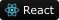
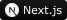

  <ul align="center">
    
<h1 style="display: inline-block">Hi 👋 I'm Can Korkmaz</h1>

  </ul>

<!-- About -->
I am a self taught Full Stack Developer

I specialize in developing projects using current technologies such as **NodeJS**, Astro, Adonis, and Svelte, Vue.

My focus is primarily on backend development and I have a keen interest in areas like VMware virtualization and
cybersecurity.
In addition to my technical skills, I also **create content** by riding motorcycles and recording videos.

## 🛠️ My Skills

### Learning:

    <picture></picture>
    <picture></picture>
    <picture></picture>
    <picture></picture>

### General Tech. Stacks:

    <picture></picture>
    <picture></picture>
    <picture></picture>
    <picture></picture>
    <picture></picture>
    <picture></picture>
    <picture></picture>

### Back-End Development:

    <picture></picture>
    <picture></picture>
    <picture></picture>
    <picture></picture>
    <picture></picture>

### Programming Languages:

    <picture></picture>
    <picture></picture>
    <picture></picture>

### Misc tools:

    <picture></picture>
    <picture></picture>
    <picture></picture>
    <picture></picture>
    <picture></picture>

### Databases:

    <picture></picture>
    <picture></picture>
    <picture></picture>
    <picture></picture>

